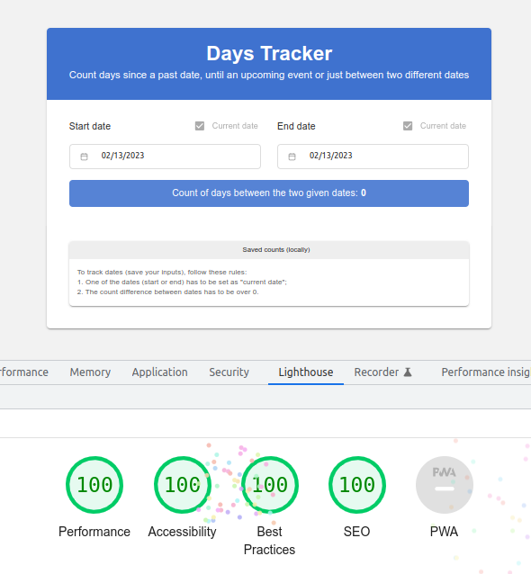
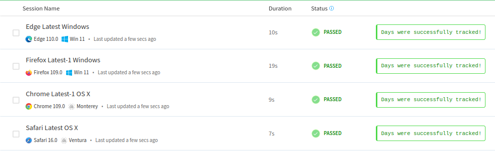

# Days Tracker

Simple date difference calculator, used to track days between dates (achievements, upcoming events...)

Check it out: http://daystracker.com

Application built with [Nuxt 3](https://nuxt.com/docs)

---

My first subject of study in this project is **web accessibility**

I will keep the results here for future references:

[W3 Test & Evaluate](https://www.w3.org/WAI/test-evaluate/preliminary/):

- Page title 
- Image text alternatives ("alt text") 
- Headings 
- Contrast ratio ("color contrast") 
- Resize text 
- Keyboard access and visual focus 
- Forms, labels, and errors 
- Moving, Flashing, or Blinking Content [N/A]
- Multimedia (video, audio) alternatives [N/A]
- Basic structure check 

Lighthouse score:

More audition tools: [reference links](https://developer.mozilla.org/en-US/docs/Learn/Tools_and_testing/Cross_browser_testing/Accessibility#auditing_tools)

---

My second subject of study here is **cross browser automated testing**

I am also keeping these here for future references:

[MDN Cross Browser testing guide](https://developer.mozilla.org/en-US/docs/Learn/Tools_and_testing/Cross_browser_testing)

Browser Stack Report (tests ran in Edge, Chrome, Safari and Firefox):

Script: [browser-test.js](https://github.com/arthursb2016/days-tracker/blob/master/browser-test.js)

Other references:

Manual free testing tool: [Browserling](https://www.browserling.com/)

End-to-end testing packages:

- [WebDriver](https://webdriver.io/docs/component-testing/vue)
- [Nightwatch](https://nightwatchjs.org/)